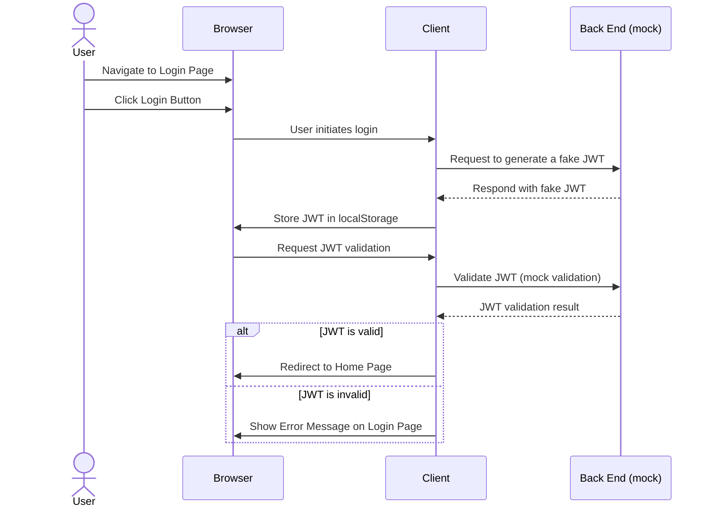

# Auth Flow

```mermaid
sequenceDiagram
    actor User
    participant Browser
    participant Client
    participant BE as Back End (mock)

    User->>Browser: Navigate to Login Page
    User->>Browser: Click Login Button
    Browser->>Client: User initiates login
    Client->>BE: Request to generate a fake JWT
    BE-->>Client: Respond with fake JWT
    Client->>Browser: Store JWT in localStorage
    Browser->>Client: Request JWT validation
    Client->>BE: Validate JWT (mock validation)
    BE-->>Client: JWT validation result
    alt JWT is valid
        Client->>Browser: Redirect to Home Page
    else JWT is invalid
        Client->>Browser: Show Error Message on Login Page
    end
```
